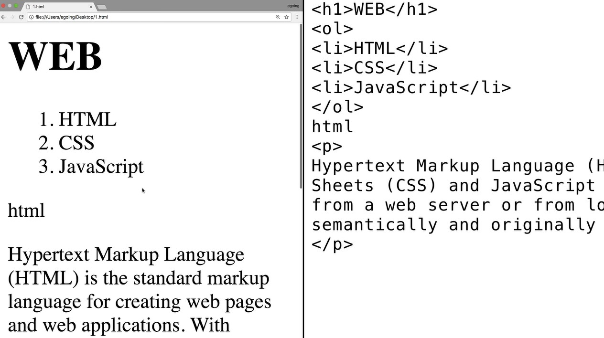

 - Reference  
    https://opentutorials.org/course/3084/18445  
    https://www.youtube.com/watch?v=MLXlXCwA0T4&list=PLuHgQVnccGMDZP7FJ_ZsUrdCGH68ppvPb&index=4  

  

오른쪽이 사람이 하는 일이면서 원인이고, 그것에대한 결과가 왼쪽이면서 기계가 하는 일  

사람이 하는 일, 다시 말해서 원인을 부르는 여러 표현이 있음   
1. 부호 또는 신호라는 의미의 'CODE'   
2. 원천이라는 뜻의 'SOURCE'   
3. 약속이라는 의미에서 '컴퓨터 언어'   

기계가 하는 일 
다시 말해서 결과를부르는 여러 표현이 있음 
 - 어플리케이션(줄여서 app, 응용프로그램) 
 - 프로그램 

웹에서는 결과를 '웹 페이지' 
웹페이지가 모여있으면 '웹 사이트'라고 함 
기능이 좀 많으면 '웹 어플리케이션' 

즉, 원인인 코드를 통해서 결과를 만든다는 것이 
코딩을 이해하는 핵심 
세상에는 다양한 종류의 코드들이 있음  
코드마다 역할이 다르기 때문에 하는 일에 따라서 적당한 코드를 선택해야함 
그 중에 웹페이지를 만드는 코드가 'HTML' 
 
HTML은 두가지 면에서 중요 
 
1. 쉽다.(이 언어의 문법을 완전히 다 배우는데 10분도 걸리지 않음) 
2. 중요하다.(웹페이지를 하루에 보는 횟수는 많다.)

